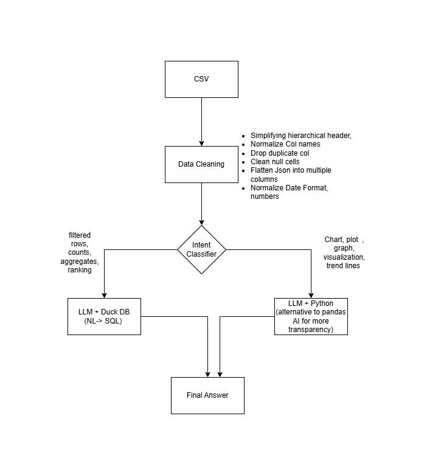

# HybridTableRAG

> **Prototype** — Chat with your tabular data using natural language. Upload a messy CSV or Excel file, let the pipeline clean and profile it, then query it in plain English.


---

## Architecture



The system classifies every natural language query by intent — structured questions (filters, counts, aggregates) go through an **LLM → DuckDB SQL** path; visualisation and transformation requests go through an **LLM → Python/pandas** path. Both return a unified result with full execution transparency.

---

## Repository Structure

```
hybridtablerag/
│
├── data/
│   ├── raw/                        # Original uploaded files
│   └── synthetic/                  # Synthetic CSV used for development
│
├── metadata/
│   └── schema_profiler.py          # Cleaning pipeline + column profiler
│
├── storage/
│   └── duckdb_manager.py           # DuckDB wrapper, schema inspection, relationship inference
│
├── llm/
│   ├── base.py                     # Abstract BaseLLM interface
│   ├── factory.py                  # get_llm() — reads .env, returns configured client
│   ├── gemini_client.py            # Gemini 2.0 client
│   ├── openai_client.py            # OpenAI client (optional)
│   └── ollama_client.py            # Ollama client (optional)
│
├── reasoning/
│   ├── sql_generator.py            # Prompt builder, DuckDB date fixer, SQL validator
│   └── query_orchestrator.py       # Intent router, SQL + Python execution paths
│
├── embeddings/                     # Placeholder — vector search (planned)
│   ├── embedding_store.py
│   └── faiss_store_index/
│
├── ui/
│   ├── streamlit_app.py            # Main pipeline UI (Upload → Clean → DuckDB → Query)
│   └── pages/
│       └── 01_chat.py              # Conversational chat interface
│
├── notebooks/                      # Per-layer Jupyter notebooks for testing
├── tests/                          # Unit tests
├── .env.example
└── requirements.txt
```

---

## How It Works

**1. Data Cleaning** (`metadata/schema_profiler.py`)

`clean_and_profile()` runs a sequential pipeline on every upload:

- Flattens MultiIndex / hierarchical CSV headers
- Normalises column names to `lowercase_underscore`
- Drops duplicate columns — by name, then by content fingerprint
- Cleans cell values: nulls, HTML tags, whitespace → `None`
- Flattens JSON columns into separate columns
- Normalises mixed-format dates element-wise (each cell parsed independently)
- Infers numeric types where possible
- Returns a cleaned DataFrame, column profile, and a BTS cleaning log

**2. DuckDB Ingestion** (`reasoning/query_orchestrator.py`)

`register_cleaned_df()` registers the cleaned DataFrame directly into DuckDB — never from the raw file. `build_schema_context()` runs three batched queries to collect column types, null counts, and sample values, which are injected into every LLM prompt.

**3. Intent Routing** (`reasoning/query_orchestrator.py`)

`IntentRouter.route()` makes a single LLM call to classify the query as `sql` or `python`. This replaces a full LangGraph setup for the current linear flow.

**4. SQL Path** (`reasoning/sql_generator.py`)

`LLMSQLGenerator` builds a schema-aware prompt, then post-processes the output: strips markdown fences, rewrites PostgreSQL-style `DATE - DATE < INTERVAL '3 days'` to DuckDB-correct integer comparisons, and validates the query is SELECT-only before execution.

**5. Python Path** (`reasoning/query_orchestrator.py`)

`PythonExecutor` prompts the LLM for pandas/Plotly code with `df` already in scope. The code is compiled before `exec()` to catch LLM error strings early. Returns a DataFrame and an optional Plotly figure.

**6. Chat UI** (`ui/pages/01_chat.py`)

Each AI response includes a **"How did I get this?"** expander with four tabs: Result · SQL/Code · Reasoning · Execution Log.

---

## Setup

### Prerequisites

- Python 3.11+
- A Gemini API key (or configure OpenAI / Ollama in `llm/factory.py`)

### Install

```bash
git clone https://github.com/your-username/HybridTableRAG.git
python -m venv venv
source venv/bin/activate        # Windows: venv\Scripts\activate
pip install -r requirements.txt
```

### Configure environment

Copy `.env.example` to `.env` and fill in your key:

```env
OPENAI_API_KEY=<Your Key>
GEMINI_API_KEY=<Your Key>
```

### Run

```bash
cd HybridTableRag>
streamlit run hybridtablerag/ui/streamlit_app.py
```

Streamlit picks up `ui/pages/01_chat.py` automatically — it appears as **Chat** in the sidebar.

---

## Usage Flow

1. **Upload** a CSV or Excel file on the main page
   *(set Header rows = 2 if your CSV has grouped column headers)*
2. **Clean & Profile** — review the cleaning log and column profile
3. **Load into DuckDB** — enter a table name and click Load
4. **Chat** — switch to the Chat page and ask questions in plain English

---

## Prototype Limitations

This is a working proof-of-concept, not a production system.

| Limitation | Notes |
|---|---|
| Single table only | One active table at a time; multi-table JOINs not yet wired |
| Explicit viz trigger | Must say "plot" or "chart" — auto-viz inference not implemented |
| No SQL retry loop | Failed queries surface the error but don't auto-retry with error context |
| No conversation memory | Each query is stateless; follow-up questions don't reference prior results |


---

## What Can Be Improved

**Auto-visualisation**
After SQL runs, a second cheap LLM call inspects the result shape and decides if a chart adds value — no need to say "plot" explicitly.

**SQL retry with LangGraph**
When DuckDB rejects a generated SQL query, feed the error back to the LLM and retry. This is the one place in the pipeline where a small LangGraph graph (generator node → executor node → conditional retry edge) genuinely earns its complexity.

**Conversation memory**
Passing the last 3–5 turns into the LLM prompt enables follow-up questions like *"now filter that by department"*.

**Multi-table queries**
`infer_relationships_structured()` already detects foreign key candidates across tables. Wiring this into the SQL prompt enables JOIN generation automatically.

---

## Vector Search — Planned Next Phase

The current system handles structured queries well. The gap is **semantic queries over free-text columns** — *"find tickets where the customer described a login problem"* cannot be answered by SQL alone.

Planned approach:

- **Embed on ingest** — text columns (descriptions, notes) are embedded using a sentence transformer and stored in FAISS (`embeddings/faiss_store_index/`)
- **Hybrid retrieval** — SQL filters narrow the candidate set in DuckDB first; vector similarity re-ranks within that filtered set
- **Router extension** — `IntentRouter` gains a third class `vector` so the orchestrator routes automatically

The `embeddings/` directory and FAISS placeholder are already in the repository in anticipation of this phase.

---

## Tech Stack

| Layer | Technology | Why |
|---|---|---|
| Data cleaning | pandas | Flexible DataFrame manipulation |
| Analytical DB | DuckDB | In-process, serverless, fast aggregations |
| LLM | Gemini 2.0 Flash | Fast, low cost, strong SQL generation |
| Orchestration | Pure Python | Linear flow — LangGraph overhead not justified yet |
| Visualisation | Plotly | Interactive charts from LLM-generated code |
| UI | Streamlit | Rapid prototyping, multipage, session state |
| Vector store | FAISS *(planned)* | Efficient similarity search for semantic queries |

---

## Contributing

Issues and PRs are welcome. If you test this on a different dataset or LLM provider, sharing results in a GitHub issue would be useful.

---

*HybridTableRAG is a prototype built for learning and demonstration. Not production-ready.*