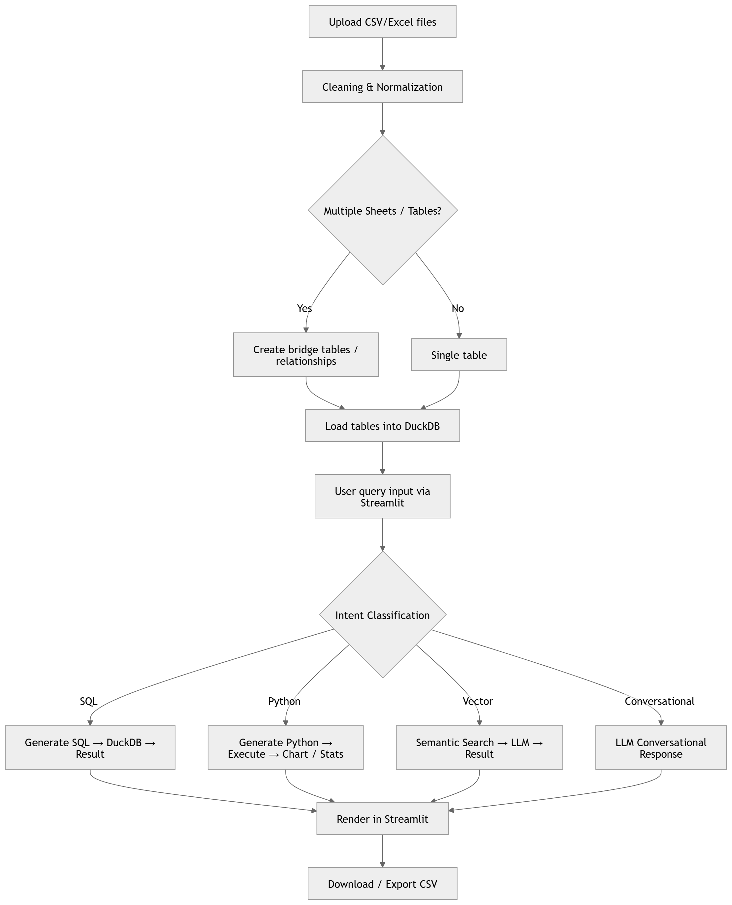

# HybridTableRAG

HybridTableRAG is an end-to-end data analytics and semantic search platform built on **Python**, **FastAPI**, **DuckDB**, and **Azure AI-powered LLMs**. It allows users to **ingest, clean, normalize, query, and visualize** structured and unstructured data seamlessly.

---

## Features

- Multi-file and multi-sheet ingestion (CSV, Excel)  
- Automatic data cleaning and normalization  
- Semantic search over tabular and textual data  
- SQL and Python query execution with auto intent detection  
- Visualization support (Plotly charts)  
- Session-based state tracking and debug logs  

---

## Architecture Flow



*The flowchart above represents the full pipeline from file upload to query execution and visualization.*

---

## Installation

```bash
git clone <repo_url>
cd hybrid_table_rag
python -m venv venv
source venv/bin/activate   # On Windows: venv\Scripts\activate
pip install -r requirements.txt
````

---

## Usage

### 1. Start API Server

```bash
uvicorn api.main:app --reload
```

### 2. Run Streamlit UI

```bash
streamlit run ui/streamlit_app.py
```

### 3. Upload Files & Test Queries

* Upload CSV/Excel files via the UI
* Review cleaning and normalization logs
* Execute SQL, Python, or semantic queries
* Download processed tables

---

## Folder Structure

```
hybrid_table_rag/
├─ api/                 # FastAPI endpoints (/ingest, /query, /health)
├─ core/                # Data cleaning, normalization, and orchestration logic
├─ reasoning/           # Intent classifier, query planner, vector search
├─ ui/                  # Streamlit testing interface
├─ assets/              # Flowchart, images, other assets
├─ tests/               # Unit tests
└─ requirements.txt
```

---

### Why Normalization?
Normalization ensures consistent column names and table structures. This improves vector embedding quality for textual columns and allows seamless SQL + semantic queries across tables in DuckDB.

---

## Session Management

* Each user session is tracked via a unique session ID
* Upload queue and query history are preserved per session
* Session can be reset directly from the Streamlit sidebar

---

## Notes

* API server **must be running** before using the Streamlit UI
* Streamlit UI is designed for **debugging and quick testing**, not production
* All data cleaning and ingestion respects **auto-detected headers** and sheet structures

